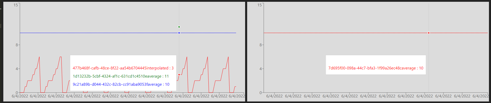
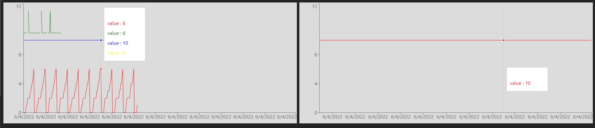
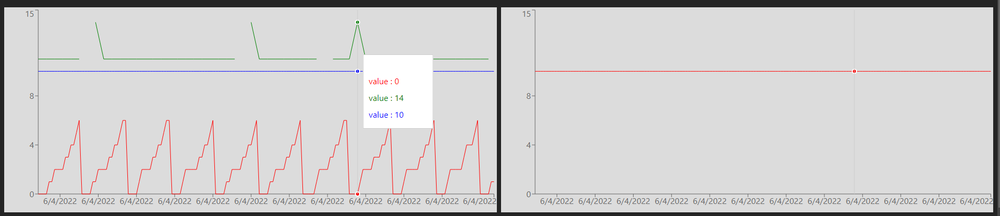

# when using data globally: no line

In this case, use dataKey per line, and a global array of data. In this case, no green line is displayed:

# when using data individually: extra line + no sync

When setting data on each line, an extra line appears, green tooltip is incorrect, and syn c between trends is broken

# when disallowing duplicate category: no sync

When setting data on each line, and sync between trends is broken

